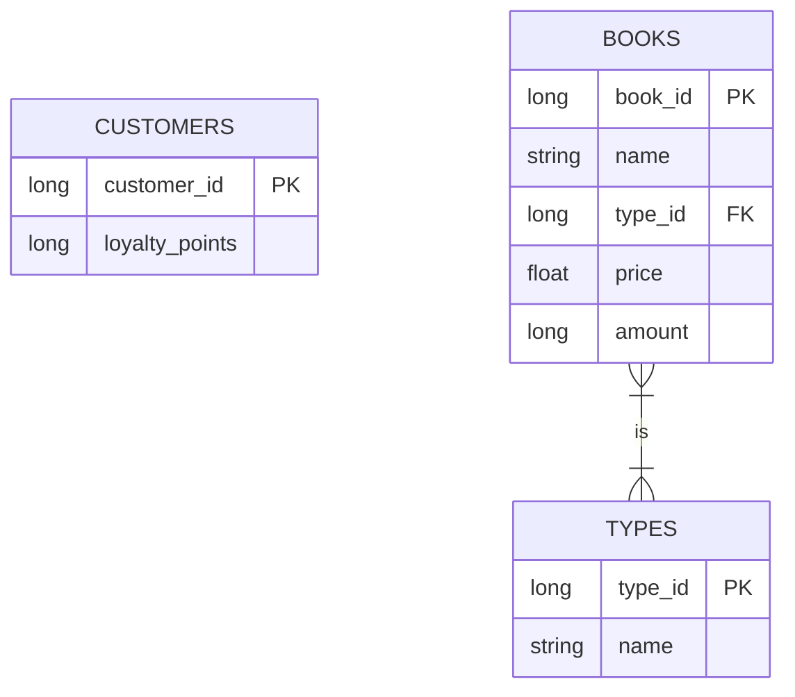

# Requirements

- Java 21
- Maven 3.9

# Installing dependencies

    mvn install

# Running application

    mvn spring-boot:run

# Endpoints

__url__:  `localhost:8081/bookstore/v1`

## Buying one or several books and calculating the price

## [POST] ../customers/{customer_id}/purchases

### Path parameters

- **customer_id** - (number) the customer id

### Request body

- **data** - a list of books to purchase
- **data[*].book_id** -(number) the id of the book
- **data[*].amount** - (number) the amount required
- **data[*].apply_discount** - (boolean) if it wants to apply discount or not. When true resets the customer loyalty points

### Response body

- **data** - an object with the result
- **data[*].price** -(number) the total price of the purchase

### Curl

```shell
curl --request POST \
  --url http://localhost:8081/bookstore/customers/{customer_id}/purchases \
  --header 'Content-Type: application/json' \
  --data '{
	"data": [
		{
			"book_id": 0,
			"amount": 0,
			"apply_discount": false
		}
	]
}'
```

## Returning the loyalty points

## [GET] ../customers/{customer_id}/loyalty-points

### Path parameters

- **customer_id** - (number) the customer id

### Response body

- **data** - an object with the result
- **data[*].loyalty_points** -(number) the customer`s loyalty points

### Curl

```shell
curl --request GET --header "Accept: application/json" http://localhost:8081/bookstore/customers/{customer_id}/loyalty-points 
```

## Returning the books available to purchase

## [GET] ../books?page=0&size=100

### Query parameters

- ***page*** (optional) - (number) the page number, Default 0
- ***size*** (optional) - (number) the page size, Default 100

### Response Body

- **data** - an object with the result
- **data[*].book_id** -(number) the id of the book
- **data[*].name** -(string) the book`s name
- **data[*].price** -(number) the book`s price

### Curl

```shell
curl --request GET \
  --url 'http://localhost:8081/bookstore/books?page=0&size=100' \
  --header 'Content-Type: application/json'
```

## ER Diagram



## Connect to database

__url__: `http://localhost:8081/bookstore/h2-console/`

- **JBDC_URL**: jdbc:h2:mem:testdb
- **User Name**: sa


# Explanations

## Software Design

As software design was adopted the clean architecture that provides many benefits as separation of concerns where each layer has a specific responsibility.

## Database

As database was adopted H2 database because it is an in-memory database that works embedded within the Java application and supports many SQL standards.

## Spring boot

Spring boot provides many features  and integrations and simplified setup that speeds up the development and, it offers testing support.


## Business Rules


### loyalty points and book types

- First all, I decide to give to the customer the decision of using or not the loyalty points instead of applying automatically because I think it up to the customer decides in which book might be free
- The scenario when the customer decides to use his loyalty points does not affect the discount by book type because the list of requirements does not point out that.
- When the customer decides to use the loyalty points, but it is not enough any error is sent out and the price is returned without consider the loyalty points.